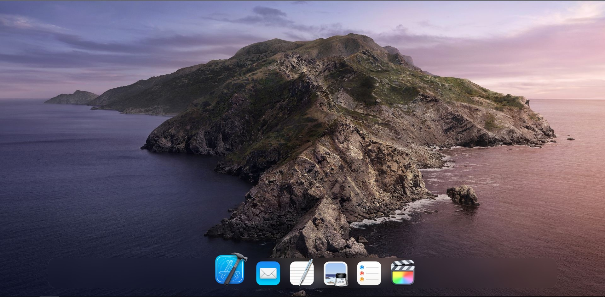
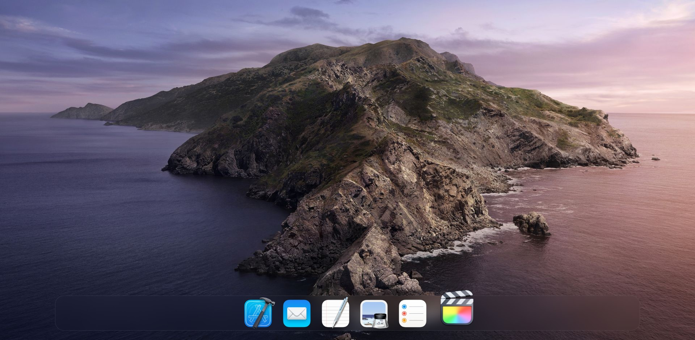

# Dock Magnification

    

        
        

            github.com /
            <code>
            <a href="https://github.com/patelka2211/Dock-Magnification" title="patelka2211/Dock-Magnification on GitHub" target="blank_" style="cursor: pointer;">
                <a href="https://github.com/patelka2211" title="patelka2211 on GitHub" style="text-decoration: none;color: #58a6ff;" target="blank_">patelka2211</a> / <a href="https://github.com/patelka2211/Dock-Magnification" title="patelka2211/Dock-Magnification on GitHub" style="text-decoration: none;color: #58a6ff;" target="blank_">Dock-Magnification</a>
            </a>
        </code>
        

    

---
# Description
macOS dock magnification using HTML, CSS and JS.

# Sample images

